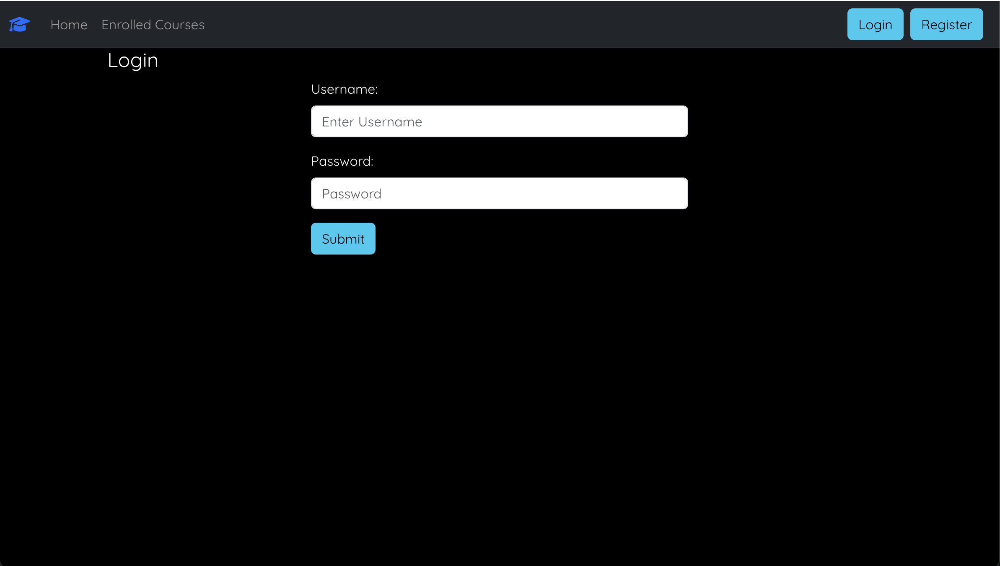
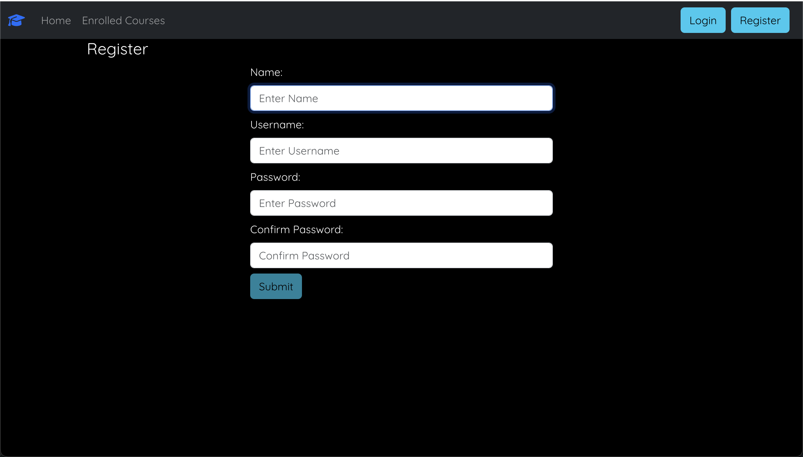
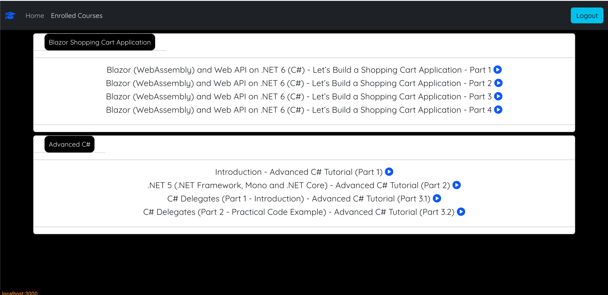
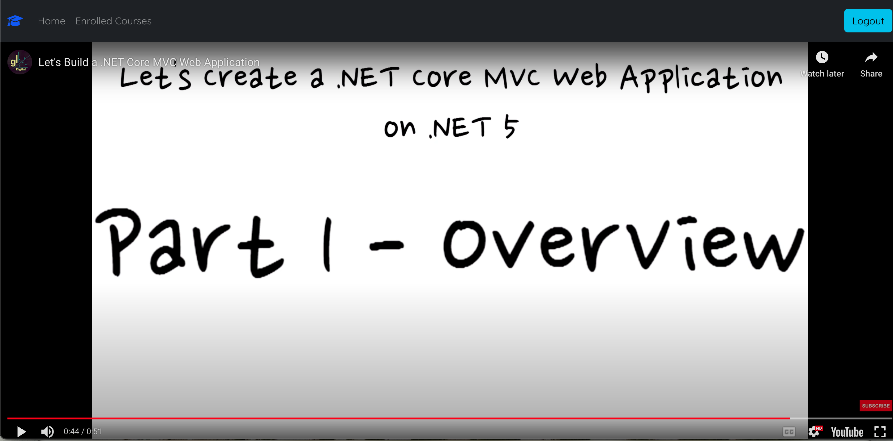

# Curriculum Management System Frontend

A modern, responsive web application for managing educational courses and content, built with React and integrated with a Spring Boot + Neo4j backend.

## Features

- 🔐 **Secure Authentication**
  - User registration with validation
  - Secure login with Basic Authentication
  - Protected routes for authenticated users

- 📚 **Course Management**
  - Browse available courses
  - View course details and lessons
  - Enroll in courses
  - Track enrolled courses

- 🎥 **Video Learning**
  - Integrated YouTube video player
  - Seamless video playback
  - Organized lesson structure

- 🎨 **Modern UI/UX**
  - Clean and intuitive interface
  - Responsive design using Bootstrap
  - Loading spinners for better UX
  - Form validation with visual feedback

## Tech Stack

- **Frontend Framework**: React 18.3.1
- **Routing**: React Router v6
- **UI Components**: 
  - Bootstrap 5.3.3
  - React Bootstrap
  - FontAwesome icons
- **HTTP Client**: Axios
- **Video Player**: React Player
- **State Management**: React Context API

## Prerequisites

- Node.js (v14 or higher)
- npm or yarn
- Backend server running on `http://localhost:8080`

## Installation

1. Clone the repository:
```bash
git clone <repository-url>
cd neo4j-application
```

2. Install dependencies:
```bash
npm install
```

3. Start the development server:
```bash
npm start
```

The application will be available at `http://localhost:3000`

## Project Structure

```
src/
├── api/              # API configuration
├── components/       # React components
│   ├── course/      # Course-related components
│   ├── enrolledCourses/ # Enrolled courses view
│   ├── header/      # Header component
│   ├── home/        # Home page
│   ├── login/       # Authentication
│   ├── register/    # User registration
│   ├── spinner/     # Loading spinner
│   └── video/       # Video player
├── context/         # React Context
├── hooks/           # Custom React hooks
└── images/          # Static images
```

## Key Features in Detail

### Authentication
- Secure user registration with validation rules:
  - Name validation
  - Username requirements (8-20 characters)
  - Password requirements (8+ chars, special chars, numbers)
  - Password confirmation
- Basic Authentication for login
- Protected routes using `RequiredAuth` component

### Course Management
- View available courses
- Course details including:
  - Course title
  - Instructor information
  - Lesson list
- Enrollment functionality
- Enrolled courses tracking

### Video Learning
- YouTube video integration
- Responsive video player
- Lesson-based video organization
- Direct access to course videos

## API Integration

The frontend communicates with the backend through the following endpoints:

- Authentication:
  - POST `/api/v1/auth/register` - User registration
  - GET `/api/v1/auth/me` - User authentication

- Courses:
  - GET `/api/v1/courses/{id}` - Get course details
  - POST `/api/v1/enrolments` - Enroll in a course
  - GET `/api/v1/enrolments` - Get enrolled courses

## Screenshots

### Home Page

*Welcome page showing the main dashboard and navigation options.*

### Login Page

*Secure login form for user authentication.*

### Registration Page

*User registration form with validation.*

### Course Listing

*List of available courses and lessons.*

### Video Player

*Integrated YouTube video player for course lessons.*

## Contributing

1. Fork the repository
2. Create your feature branch (`git checkout -b feature/AmazingFeature`)
3. Commit your changes (`git commit -m 'Add some AmazingFeature'`)
4. Push to the branch (`git push origin feature/AmazingFeature`)
5. Open a Pull Request

## License

This project is licensed under the MIT License - see the LICENSE file for details.

## Acknowledgments

- Spring Boot team for the backend framework
- Neo4j team for the graph database
- React team for the frontend framework
- Bootstrap team for the UI components
